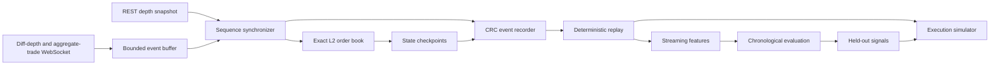

# Market Systems Workstation

A C++20/Python platform for **sequence-correct Level-2 market data, deterministic replay, execution simulation, and market-microstructure analysis**.

The project is built around a simple principle: market-data research is only credible when the data path, replay path, feature path, and evaluation path are all explicit and testable.

It does **not** claim live profitability or production readiness. Its purpose is to demonstrate reliable systems engineering, reproducible experimentation, and honest execution assumptions.

## Highlights

- **C++20 market-data core** using Boost.Beast, OpenSSL, simdjson, pybind11, and NumPy.
- **Sequence-correct Binance L2 synchronization** using buffered diff-depth events plus REST snapshots.
- **Exact fixed-point books** with independent `std::map` and cache-oriented flat implementations.
- **Lock-free SPSC publication** with documented acquire/release memory ordering.
- **CRC-protected event recording** with atomic completion metadata and state checkpoints.
- **Deterministic replay** verified through intermediate and final order-book hashes.
- **Execution simulation** with market/limit orders, partial fills, latency, fees, queue-ahead sensitivity, inventory limits, and kill switches.
- **Leakage-aware research** with chronological sessions, train-only normalization, validation-only selection, untouched holdouts, and test-set fingerprints.
- **Cross-platform CI** covering Python, C++, sanitizers, thread checks, and fuzz-smoke tests.
- **Native desktop interface** for capture, replay, diagnostics, research, and evidence inspection.

## System architecture



A separate top-of-book path remains available as a compact benchmark and compatibility pipeline:

```text
TLS WebSocket -> simdjson -> fixed 32-byte state
              -> SPSC queue -> pybind11/NumPy
              -> independent recorder -> deterministic replay
```

Detailed design documents:

- [Architecture](ARCHITECTURE.md)
- [L2 synchronization and data flow](L2_ARCHITECTURE.md)
- [Binary event format](L2_FORMAT.md)
- [Execution assumptions](EXECUTION_MODEL.md)
- [Performance methodology](PERFORMANCE_METHODOLOGY.md)
- [System-design walkthrough](SYSTEM_DESIGN_WALKTHROUGH.md)
- [Engineering decisions](DECISIONS.md)

## Correctness contracts

### L2 synchronization

The synchronizer:

1. Buffers diff-depth events before snapshot installation.
2. Downloads a REST snapshot.
3. Drops buffered events already covered by the snapshot.
4. Requires the first retained event to bridge `lastUpdateId + 1`.
5. Applies later updates only when their ranges remain continuous.
6. Detects gaps, records a boundary, and resynchronizes.

### Deterministic recording and replay

Current-format recordings preserve snapshots, depth deltas, aggregate trades, continuity boundaries, and book checkpoints. A replay is accepted only when it reproduces the expected update ID and state hashes.

### Research discipline

The research pipeline uses complete chronological sessions when enough data is available. Normalization is fitted on training data only; regularization and signal thresholds are selected on validation data only; the final test set is fingerprinted and evaluated once unless reuse is made explicit.

### Execution honesty

Aggregated depth does not reveal exact order-level queue priority. Passive fills are therefore reported across explicit sensitivity models rather than presented as observed ground truth.

## Repository layout

```text
C++ core
  RingBuffer.hpp
  MarketEngine.hpp
  L2Book.hpp
  L2Synchronizer.hpp
  L2BinaryFormat.hpp
  Bindings.cpp

Python data and research
  l2_capture.py
  l2bin.py
  l2book.py
  l2_features.py
  l2_research.py
  execution_simulator.py
  research.py
  research_diagnostics.py

Desktop application
  market_workstation.py
  market_ui/

Verification and tests
  verify_workstation.py
  verify_l2_replay.py
  tests/
  fuzz/
  benchmarks/
```

The native extension retains the internal module name `quant_engine` for ABI compatibility with the existing Windows build. Public project branding and command names are intentionally engineering-first.

## Build from source

### Requirements

- CPython 3.12 x64
- CMake 3.21+
- A C++20 compiler
- pybind11
- Boost.System
- OpenSSL
- simdjson
- vcpkg on Windows

### Python environment

```powershell
py -3.12 -m venv .venv
.\.venv\Scripts\python.exe -m pip install --upgrade pip
.\.venv\Scripts\python.exe -m pip install -r requirements-dev.txt
```

### Windows native build

Install Visual Studio Build Tools with **Desktop development with C++**, then point the script at vcpkg:

```powershell
$env:VCPKG_ROOT = "C:\path\to\vcpkg"
.\BUILD_NATIVE.ps1
```

`BUILD_NATIVE.ps1` locates Visual Studio through `vswhere`, activates the x64 MSVC developer environment, and configures Ninja with `cl.exe`. This prevents MinGW/MSVC library mismatches when linking the static vcpkg dependencies.

For a manual build, first open an **x64 Native Tools Command Prompt for Visual Studio**, then run from the repository root:

```cmd
.venv\Scripts\cmake.exe -S . -B build-native -G Ninja ^
  -DCMAKE_BUILD_TYPE=Release ^
  -DCMAKE_C_COMPILER=cl.exe ^
  -DCMAKE_CXX_COMPILER=cl.exe ^
  -DCMAKE_TOOLCHAIN_FILE=%VCPKG_ROOT%\scripts\buildsystems\vcpkg.cmake ^
  -DVCPKG_TARGET_TRIPLET=x64-windows-static-md ^
  -DMARKET_BUILD_TESTS=ON ^
  -DMARKET_BUILD_BENCHMARKS=ON
.venv\Scripts\cmake.exe --build build-native --parallel
.venv\Scripts\ctest.exe --test-dir build-native --output-on-failure
```

Copy the built `quant_engine.cp312-win_amd64.pyd` into the repository root, then run:

```powershell
.\.venv\Scripts\python.exe verify_workstation.py
.\.venv\Scripts\python.exe market_workstation.py
```

## Common workflows

### Capture L2 sessions

```powershell
.\.venv\Scripts\python.exe l2_capture.py `
  --symbols BTCUSDT ETHUSDT `
  --duration-minutes 30 `
  --output-dir recordings/l2
```

Each symbol produces:

```text
<symbol>-<time>.l2bin
<symbol>-<time>.l2bin.l2chk
<symbol>-<time>.l2bin.meta.json
```

### Verify deterministic replay

```powershell
.\.venv\Scripts\python.exe verify_l2_replay.py `
  recordings/l2/btcusdt-....l2bin `
  --speeds 0 10 1
```

### Run benchmarks

```powershell
.\.venv\Scripts\python.exe l2_benchmark.py `
  recordings/l2/btcusdt-....l2bin `
  --trials 7
```

For the native order-book benchmark:

```powershell
.\build-native\l2_book_benchmark.exe 1000000
```

### Run chronological research

```powershell
$sessions = Get-ChildItem recordings\l2\btcusdt-*.l2bin |
  Sort-Object Name |
  Select-Object -ExpandProperty FullName

.\.venv\Scripts\python.exe l2_research.py $sessions `
  --horizons 20 `
  --fee-bps-per-side 0.0 `
  --slippage-bps-per-side 0.0 `
  --output-dir artifacts/l2
```

### Replay held-out signals through execution assumptions

The research report is mandatory. It binds the prediction CSV and each held-out session ID to the exact recording and checkpoint hashes used by the experiment.

```powershell
.\.venv\Scripts\python.exe l2_execution_sensitivity.py `
  artifacts/l2/l2_h20_test_predictions.csv `
  --research-report artifacts/l2/l2_h20_report.json `
  --recording 0=recordings/l2/session-a.l2bin `
  --recording 1=recordings/l2/session-b.l2bin `
  --style passive `
  --quantity 0.001 `
  --latencies-us 0 100 250 500 1000
```

## Testing

```powershell
.\.venv\Scripts\python.exe -m compileall -q -f .
.\.venv\Scripts\python.exe -m ruff check .
.\.venv\Scripts\python.exe -m pytest
ctest --test-dir build-native --output-on-failure
```

CI additionally runs AddressSanitizer, UndefinedBehaviorSanitizer, ThreadSanitizer on the SPSC queue, and a bounded L2 binary-format fuzz target.

## Honest limitations

- The feed is aggregated L2, not order-by-order market-by-order data.
- Exact exchange queue position is not observable.
- Passive-fill results are model sensitivity, not historical ground truth.
- Local receipt timestamps are not exchange-to-host latency.
- Short recordings are suitable for systems validation, not profitability claims.
- Results must be regenerated from current-format complete recordings before publication.
- Production deployment would require additional operational controls, exchange-specific validation, monitoring, and risk governance.

## License

MIT License. See [LICENSE](LICENSE).
