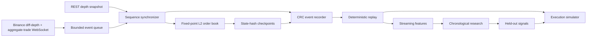

# High-Performance Market Data & Execution Engine

A C++20/Python market-systems project for **sequence-correct Level-2 reconstruction, deterministic recording/replay, event-driven execution simulation, and leakage-aware quantitative research**.

The system emphasizes explicit correctness contracts around market-data continuity, fixed-point state, binary integrity, replay identity, concurrency, and research provenance. The native extension remains named `quant_engine` for ABI/import compatibility.

> **Scope:** execution in this repository is a simulator for research and sensitivity analysis. It is not a live exchange order gateway, and the benchmark figures below are isolated component measurements rather than end-to-end exchange throughput or latency.

## Engineering highlights

- **C++20 market-data core** using Boost.Asio/Beast, OpenSSL, simdjson, pybind11, and NumPy.
- **Sequence-correct Binance L2 synchronization** using buffered diff-depth events plus REST snapshots.
- **Exact fixed-point books** with independent `std::map` and cache-oriented flat implementations.
- **Lock-free SPSC publication** with explicit single-producer/single-consumer ownership and acquire/release ordering.
- **CRC-protected event recording** with finalized SHA-256 provenance metadata and deterministic state checkpoints.
- **Deterministic replay** verified through update-ID continuity and intermediate/final order-book hashes.
- **Execution simulation** for market/limit orders, partial fills, latency, fees, queue-ahead sensitivity, inventory limits, and kill switches.
- **Leakage-aware research** with chronological sessions, train-only normalization, validation-only selection, untouched holdouts, and test-set fingerprints.
- **Cross-platform verification** with Python/native tests, Windows/Linux CI, ASan, UBSan, TSan, and libFuzzer smoke coverage.
- **Desktop tooling** for capture, replay, diagnostics, research, and evidence inspection.

## Architecture


```mermaid
flowchart LR
    WS[Binance diff-depth + aggregate-trade WebSocket] --> BUFFER[Bounded event queue]
    SNAPSHOT[REST depth snapshot] --> SYNC[Sequence synchronizer]
    BUFFER --> SYNC
    SYNC --> BOOK[Fixed-point L2 order book]
    SYNC --> RECORDER[CRC event recorder]
    BOOK --> CHECKPOINTS[State-hash checkpoints]
    CHECKPOINTS --> RECORDER
    RECORDER --> REPLAY[Deterministic replay]
    REPLAY --> FEATURES[Streaming features]
    FEATURES --> RESEARCH[Chronological research]
    REPLAY --> EXECUTION[Execution simulator]
    RESEARCH --> SIGNALS[Held-out signals]
    SIGNALS --> EXECUTION
```

A separate compact top-of-book path remains available for native ingestion/replay and the SPSC microbenchmark:

```text
TLS WebSocket -> simdjson -> 32-byte OrderBookState
              -> SPSC ring buffer -> pybind11 / NumPy
              -> binary recorder -> deterministic replay
```

Detailed documentation:

- [System architecture](docs/architecture/overview.md)
- [L2 synchronization and data flow](docs/architecture/l2-data-flow.md)
- [System-design walkthrough](docs/architecture/system-design.md)
- [L2 binary format](docs/formats/l2-binary-format.md)
- [Execution-model assumptions](docs/execution/model.md)
- [Performance methodology](docs/performance/methodology.md)
- [Engineering decisions](docs/development/decisions.md)
- [Development workflow](docs/development/development.md)

## Correctness contracts

### Sequence-correct L2 reconstruction

The synchronizer buffers diff-depth updates while a REST snapshot is obtained, removes events already represented by the snapshot, and requires the first retained update to span `lastUpdateId + 1`. Later updates must remain continuous. A gap invalidates local reconstruction and forces resynchronization instead of allowing a plausible-looking but incorrect book to continue.

When a snapshot is installed before a bridging event is available, that exact snapshot is retained while later WebSocket events arrive. The capture path does not repeatedly chase newer snapshots simply because the bridge has not appeared yet.

### Exact price-level identity

L2 prices and quantities are represented as scaled integers. Fixed-point representation avoids floating-point equality ambiguity when comparing, sorting, hashing, recording, and replaying exact exchange price levels. Quantity zero is interpreted as a deletion signal rather than an active resting level.

### Deterministic recording and replay

Current-format L2 recordings preserve snapshots, depth deltas, aggregate trades, continuity boundaries, and book checkpoints. Per-event CRC32 detects accidental payload corruption. Finalized metadata binds the recording and checkpoint sidecar through SHA-256 hashes. Replay is accepted only when sequence/state invariants reproduce the expected logical book state.

### Research discipline

Chronological research fits normalization on training data only, performs model/threshold selection on validation data only, and leaves the final holdout untouched until evaluation. Session boundaries prevent features and labels from crossing discontinuities. Published reports fingerprint held-out evidence and bind results to exact source-recording hashes.

### Execution-model honesty

Aggregated L2 does not expose exact order-level queue priority. Passive fills therefore use explicit queue-ahead assumptions and are reported as model sensitivity rather than historical ground truth. Marketable orders consume modeled visible liquidity in price priority, and locally consumed liquidity cannot be reused until the exchange explicitly refreshes that level.

## Measured component performance

These are **microbenchmark results**, not claims about complete exchange-to-strategy throughput or latency.

- **Flat L2 order book:** 42.8K updates/s median across five deterministic 1M-update runs, **6.7×** the `std::map` reference median. Both implementations finished every run with the same logical state hash.
- **SPSC ring buffer:** 377.5M 32-byte records/s median across five 1B-record producer/consumer runs. The hardened benchmark observes all 32 payload bytes and validates a deterministic, non-cryptographic payload-integrity guard so the transfer cannot collapse to a timestamp-only workload.

The benchmark sources are in [`benchmarks/native/`](benchmarks/native/). See [performance methodology](docs/performance/methodology.md) for scope and interpretation.

## Repository layout

```text
market-data-execution-engine/
├── native/
│   ├── include/market_engine/
│   │   ├── concurrency/      # SPSC publication
│   │   ├── core/             # fixed-size top-of-book state
│   │   ├── engine/           # ingestion/replay lifecycle
│   │   ├── market_data/      # Binance feed + L2 synchronization
│   │   ├── order_book/       # fixed-point L2 types/books
│   │   └── recording/        # binary formats, recorder, replay
│   └── src/                  # pybind11 bindings
├── market_engine/
│   ├── market_data/          # Python reconstruction/capture/microstructure
│   ├── recording/            # qbin/L2 readers and writers
│   ├── execution/            # simulator and sensitivity analysis
│   ├── research/             # features, diagnostics, experiments
│   ├── cli/                  # command-line entry points
│   └── ui/                   # desktop interface
├── benchmarks/native/        # isolated C++ microbenchmarks
├── tests/
│   ├── native/               # C++ correctness tests
│   └── python/               # Python regression/integration tests
├── fuzz/                     # libFuzzer target
├── scripts/windows/          # Windows build/capture helpers
├── docs/                     # architecture, formats, execution, methodology
├── recordings/               # generated recordings (gitignored except .gitkeep)
├── artifacts/                # generated research evidence (gitignored except .gitkeep)
├── CMakeLists.txt
├── pyproject.toml
└── vcpkg.json
```

The folders are organized by **engineering responsibility**, not by generic concepts such as “atomics” or “systems.” A file lives with the subsystem whose behavior it implements.

## Build from source

### Requirements

- CPython 3.12 x64
- CMake 3.21+
- C++20 compiler
- pybind11
- Boost.System
- OpenSSL
- simdjson
- vcpkg on Windows

### Python environment

```powershell
py -3.12 -m venv .venv
.\.venv\Scripts\python.exe -m pip install --upgrade pip
.\.venv\Scripts\python.exe -m pip install -r requirements-dev.txt
.\.venv\Scripts\python.exe -m pip install -e .
```

If the Windows Python launcher does not expose your CPython 3.12 installation, create the environment with the `python` executable that reports Python 3.12 instead.

### Windows native build

Install Visual Studio Build Tools with **Desktop development with C++**, then point the build at your vcpkg installation:

```powershell
$env:VCPKG_ROOT = "C:\vcpkg"
Set-ExecutionPolicy -Scope Process -ExecutionPolicy Bypass -Force
.\scripts\windows\build_native.ps1
```

The script resolves the repository root, activates the x64 MSVC environment through `vswhere`/`VsDevCmd.bat`, configures Ninja with `cl.exe`, builds the native extension/tests/benchmarks, runs native tests, installs `quant_engine.cp312-win_amd64.pyd`, and runs the full workstation verifier.

For a manual build from an x64 Native Tools Command Prompt:

```cmd
.venv\Scripts\cmake.exe -S . -B build-native -G Ninja ^
  -DCMAKE_BUILD_TYPE=Release ^
  -DCMAKE_C_COMPILER=cl.exe ^
  -DCMAKE_CXX_COMPILER=cl.exe ^
  -DCMAKE_TOOLCHAIN_FILE=%VCPKG_ROOT%\scripts\buildsystems\vcpkg.cmake ^
  -DVCPKG_TARGET_TRIPLET=x64-windows-static-md ^
  -DMARKET_BUILD_TESTS=ON ^
  -DMARKET_BUILD_BENCHMARKS=ON
.venv\Scripts\cmake.exe --build build-native --parallel
.venv\Scripts\ctest.exe --test-dir build-native --output-on-failure
```

Launch the desktop application:

```powershell
.\.venv\Scripts\python.exe -m market_engine.cli.workstation
```

## Common workflows

### Capture L2 sessions

```powershell
.\.venv\Scripts\python.exe -m market_engine.market_data.l2_capture `
  --symbols BTCUSDT ETHUSDT `
  --duration-minutes 30 `
  --output-dir recordings/l2
```

Each finalized symbol session produces the `.l2bin` data file, `.l2chk` checkpoint sidecar, and `.meta.json` provenance metadata.

### Verify deterministic L2 replay

```powershell
.\.venv\Scripts\python.exe -m market_engine.cli.verify_l2_replay `
  recordings/l2/btcusdt-....l2bin `
  --speeds 0 10 1
```

### Run L2 benchmarks

```powershell
.\.venv\Scripts\python.exe -m market_engine.cli.l2_benchmark `
  recordings/l2/btcusdt-....l2bin `
  --trials 7
```

Native component benchmarks after a build:

```powershell
.\build-native\l2_order_book_benchmark.exe 1000000
.\build-native\spsc_queue_benchmark.exe 1000000000
```

### Run chronological L2 research

```powershell
$sessions = Get-ChildItem recordings\l2\btcusdt-*.l2bin |
  Sort-Object Name |
  Select-Object -ExpandProperty FullName

.\.venv\Scripts\python.exe -m market_engine.research.l2_pipeline $sessions `
  --horizons 20 `
  --fee-bps-per-side 0.0 `
  --slippage-bps-per-side 0.0 `
  --output-dir artifacts/l2
```

### Replay held-out signals through execution assumptions

The research report is mandatory. It binds the prediction CSV and held-out session IDs to exact recording/checkpoint hashes.

```powershell
.\.venv\Scripts\python.exe -m market_engine.execution.sensitivity `
  artifacts/l2/l2_h20_test_predictions.csv `
  --research-report artifacts/l2/l2_h20_report.json `
  --recording 0=recordings/l2/session-a.l2bin `
  --recording 1=recordings/l2/session-b.l2bin `
  --style passive `
  --quantity 0.001 `
  --latencies-us 0 100 250 500 1000
```

## Verification

```powershell
.\.venv\Scripts\python.exe -m compileall -q -f market_engine tests/python
.\.venv\Scripts\python.exe -m ruff check .
.\.venv\Scripts\python.exe -m pytest -q
.\.venv\Scripts\python.exe -m market_engine.cli.verify_workstation
.\.venv\Scripts\ctest.exe --test-dir build-native --output-on-failure
```

GitHub Actions additionally exercises Linux/Windows native builds, AddressSanitizer, UndefinedBehaviorSanitizer, ThreadSanitizer for the SPSC queue, and a bounded libFuzzer smoke target.

## Limitations

- Binance input is aggregated L2, not market-by-order data.
- Exact exchange queue position is unobservable from this feed.
- Passive-fill results are execution-model sensitivity, not historical ground truth.
- Local receipt timestamps are not synchronized exchange-to-host latency.
- SPSC benchmark throughput is isolated queue throughput, not full market-data throughput.
- Short captures are systems-validation evidence, not profitability evidence.
- Production deployment would require additional operational controls, exchange-specific validation, monitoring, and risk governance.

## License

MIT License. See [LICENSE](LICENSE).
